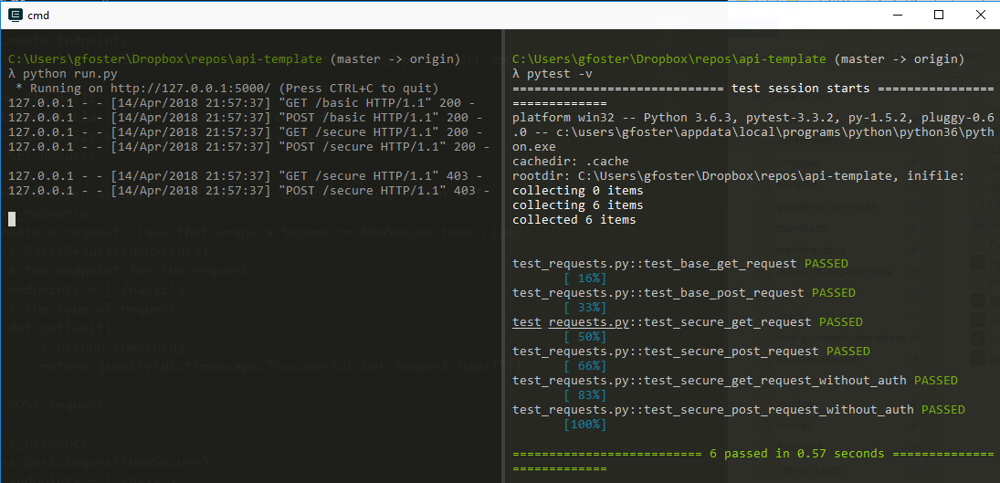

# Heroku API Template
*a template for creating API's on heroku*

* Easily Create Secure and Non-Secure Endpoints
* Effortlessly Manage Get, Post, Put, Patch, and Delete Requests
* Simple tests for your API before pushing to production

## Initial Setup
1. clone this repo
2. cd into cloned repo
3. pip install -r requirements.txt

## Local API Development Server
*run a local API server*
1. python run.py

## Local API Development Tests
*run tests via pytest to verify request endpoints are working*
1. pytest -v



## Create Endpoints
*all endpoint development should happen in **routing.py** under app*

# How Its Built
## Endpoint Class **app.api.rest.routing.py**
*you can easily build each endpoint as its own class*
### GET Request
```python
# this wrapper automatically adds the endpoints to the rest API
@rest_resource
# create a request class that wraps a Secure or NonSecure base class
class BasicRequest(NonSecure):
	# the endpoint for the request
    endpoints = ['/basic']
    # the type of request
    def get(self):
    	# return something
        return jsonify(dict(message="Successful Get Request Made!"))
```
### POST Request
```python
@rest_resource
class BasicRequest(NonSecure):
    endpoints = ['/base']

    def post(self):
        if request.data:
        	return jsonify(request.json)
        else:
        	return abort(400, message='Please Send Data!')
```